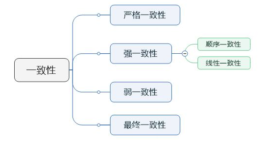

#### 1. 一致性的分类

一般来讲，分布式系统中的一致性（strong consistency）按照对一致性要求的不同，主要分为，**严格一致性，强一致性，弱一致性和最终一致性**这四大类。

#### 2. 严格一致性

在分布式系统中，有一种理想状态的“严格一致性”。严格一致性的标准是，对于数据项x的任何读操作将返回最近一次对x进行的写操作的结果所对应的值。严格一致性中存在的在分布式系统中，有一种理想状态的“严格一致性”。

严格一致性的标准是，对于数据项x的任何读操作将返回最近一次对x进行的写操作的结果所对应的值。

严格一致性中存在的问题是它依赖于绝对的全局时间。对于所有的进程来说，所有写操作都是瞬间可见的，系统维持着一个绝对的全局时间顺序。如果一个数据项被改变了，那么无论数据项改变之后多久执行读操作，无论哪些进程执行读操作，无论这些进程的位置如何，所有在该数据项上执行的后续读操作都将得到新数值。

严格一致性，是在系统不发生任何故障，而且所有节点之间的通信无需任何时间这种理想的条件下，才能达到。这个时候整个系统其实就等价于一台机器了。在现实中，是不可能达到的。

实际上，**越强的一致性要求往往会造成越弱的处理性能，以及越差的可扩展性。**

#### 3.强一致性

当满足强一致性时，满足如下要求：

当分布式系统中更新操作完成之后，任何多个进程或线程，访问系统都会获得最新的值。

一般来讲，强一致性（strong consistency）主要包括下面两类

- - **顺序一致性**
  - **线性一致性**

**顺序一致性**是指任何执行结果都是相同的，就好像所有进程对数据存储的读、写操作是按某种序列顺序执行的，并且每个进程的操作按照程序所指定的顺序出现在这个序列中 。

> 顺序一致性的介绍比较抽象，这里举一个例子来说明。
> 例子摘自：**并行编程——内存模型之顺序一致性**
>
> 假设我们有两个线程（线程1和线程2）分别运行在两个CPU上，有两个初始值为0的全局共享变量x和y，两个线程分别执行下面两条指令：
> **初始条件： x = y = 0;**

> 因为多线程程序是交错执行的，所以程序可能有如下几种执行顺序：

> 当然上面三种情况并没包括所有可能的执行顺序，但是它们已经包括所有可能出现的结果了，所以我们只举上面三个例子。我们注意到这个程序只可能出现上面三种结果，但是不可能出现r1==0 and r2==0的情况。
> **所谓的顺序一致性，**其实就是规定了一下两个条件：
> **（1）每个线程内部的指令都是按照程序规定的顺序（program order）执行的（单个线程的视角）**
> **（2）线程执行的交错顺序可以是任意的，但是所有线程所看见的整个程序的总体执行顺序都是一样的（整个程序的视角）**
>
> 第一点很容易理解，就是说线程1里面的两条语句一定在该线程中一定是x=1先执行，r1=y后执行。
> 第二点就是说线程1和线程2所看见的整个程序的执行顺序都是一样的。
> 举例子就是假设线程1看见整个程序的执行顺序是我们上面例子中的Execution 1，那么线程2看见的整个程序的执行顺序也是Execution 1，不能是Execution 2或者Execution 3。

总结下来，**顺序一致性，要求所有线程所见的整个程序的总体执行顺序是一样的。也就是说，顺序一致性保证的是对一系列地址访问的一致性。**

顺序一致性实际上**限制了各进程内指令的偏序关系**，但不在进程间按照物理时间进行全局排序**。**

**线性一致性**假设操作具有一个**全局有效时钟的时间戳**，但是这个时钟仅具有有限的精确度。要求时间戳在前的进程先执行。线性化是**根据一系列同步时钟**确定序列顺序的 。

- **弱一致性**

**弱一致性**是指系统并不保证后续进程或线程的访问都会返回最新的更新的值。系统在数据成功吸入之后，不承诺立即可以读到最新写入的值，也不会具体承诺多久读到。但是会尽可能保证在某个时间级别（秒级）之后。可以让数据达到一致性状态。**也就是说**，如果能容忍后续的部分或者全部访问不到，则是弱一致性。

- **最终一致性**

**最终一致性**是弱一致性的特定形式。系统保证在没有后续更新的前提下，系统最终返回上一次更新操作的值。 **也就是说**，如果经过一段时间后要求能访问到更新后的数据，则是最终一致性。

在最终一致性的要求下，如果没有故障发生，不一致窗口的时间主要受通信延迟，系统负载和复制副本的个数影响。DNS是一个典型的最终一致性系统。

